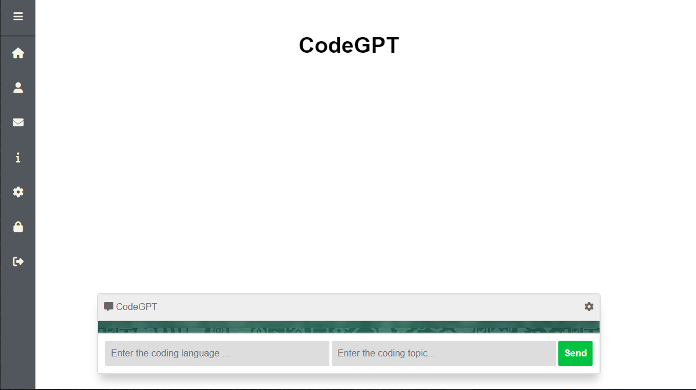

# CodeGPT: Streamlining Code Generation
CodeGPT is a revolutionary tool designed to expedite code generation using minimal prompts, boosting productivity for everyday coding tasks.
<br>


# CodeGPT can generate code in multiple programming languages. These are:

- **Python** 
- **JavaScript** 
- **Java**
- **C++**
- **C#**
- **Ruby**
- **PHP** 
- **Swift** 
- **Kotlin** 
- **Go** 
- **Rust**
etc


# Key Features

- **Efficient Code Generation:** CodeGPT enables users to generate code swiftly by inputting only a couple of prompt words.
- **Cutting-Edge Technology:** Developed using advanced technologies like OpenAI and LangChain.
- **User-Friendly Interface:** Crafted an intuitive and sophisticated user interface through expertise in web development.
- **Seamless Deployment:** Ensured smooth deployment on an AWS EC2-ECR instance using efficient CI/CD pipelines.

Get started with CodeGPT today and streamline your code creation process like never before!

# Steps to Run it
### 1. Cloning the Repository
```bash
git clone https://github.com/MANMEET75/CodeGPT.git
```
### 2. Creating the virtual environment using anaconda
```bash
conda create -p codegpt python=3.10 -y
```

### 3. Activate the virtual environment
```bash
conda activate codegpt/
```

### 4. Installing the dependencies
```bash
pip install -r requirements.txt
```

## 5. Check the CodeGPT
```bash
python app.py
```

## 7. Please access the provided link through your terminal.
Upon initiation, you'll encounter a user interface similar to the following design:


# AWS-CICD-Deployment-with-Github-Actions

## 1. Login to AWS console.

## 2. Create IAM user for deployment

	#with specific access

	1. EC2 access : It is virtual machine

	2. ECR: Elastic Container registry to save your docker image in aws


	#Description: About the deployment

	1. Build docker image of the source code

	2. Push your docker image to ECR

	3. Launch Your EC2 

	4. Pull Your image from ECR in EC2

	5. Lauch your docker image in EC2

	#Policy:

	1. AmazonEC2ContainerRegistryFullAccess

	2. AmazonEC2FullAccess

	
## 3. Create ECR repo to store/save docker image
    - Save the URI: 566373416292.dkr.ecr.ap-south-1.amazonaws.com/mlproj

	
## 4. Create EC2 machine (Ubuntu) 

## 5. Open EC2 and Install docker in EC2 Machine:
	
	
	#optinal

	sudo apt-get update -y

	sudo apt-get upgrade
	
	#required

	curl -fsSL https://get.docker.com -o get-docker.sh

	sudo sh get-docker.sh

	sudo usermod -aG docker ubuntu

	newgrp docker
	
# 6. Configure EC2 as self-hosted runner:
    setting>actions>runner>new self hosted runner> choose os> then run command one by one


# 7. Setup github secrets:

    AWS_ACCESS_KEY_ID=

    AWS_SECRET_ACCESS_KEY=

    AWS_REGION = us-east-1

    AWS_ECR_LOGIN_URI = demo>>  566373416292.dkr.ecr.ap-south-1.amazonaws.com

    ECR_REPOSITORY_NAME = simple-app

Enjoy Coding!
